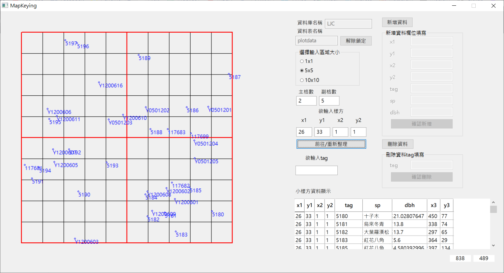

# Plant Spatial Points Tool  
   
  
* This is a software about annotation for plant spatial points, need PostgreSQL, build applications in Python  
* [Windows Releases](https://github.com/leeyaowen/Mapkeying_python/releases)  

## PostgreSQL setting(with pgAdmin)
1. set server default.
2. set password -> 2717484.
3. create a database **{your database name}**.
4. set a relation **{your relation name}**(e.g., plotdata).
5. set column, including **x1,y1,x2,y2,tag,sp,dbh,x3,y3**, set dbh as numeric. Otherwise, text.  
6. set tag as primary key(in Constraints setting).  
7. import data(csv format, and UTF-8 is encoding.  

### About ralation column name
* x1,y1,x2,y2 -> plot position  
* tag -> plant ID  
* sp -> species name  
* dbh -> diameter breast height  
* x3,y3 -> plants points position, record by this program  

### commonly used sql commands
> in SQL Eidtor
>> `select * from plotdata` -> select all data from plotdata  
>> `select * from plotdata where x3 is null` -> select x3 data is null from plotdata  

## Important!  
1. enter the database and relation name, and lock  
2. choose area(meter)    
3. set main/sub grids，e.g., (1,5)/(2,5)/(3,3)  
4. click 'Go/Refresh' button   

### Screenshot  

